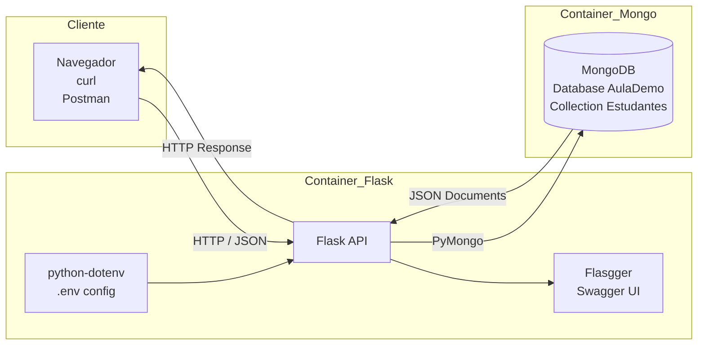

# Desenvolvendo uma API REST com Flask e Swagger

## 1. Introdução

O Flask é um microframework Python para desenvolvimento de aplicações web. Ele é bastante leve e extensível, sendo adequado tanto para iniciantes quanto para desenvolvedores experientes.

Ao contrário de frameworks mais complexos, como o Django, que já trazem diversos componentes integrados (ORM, autenticação, administração, templates, entre outros), o Flask segue uma abordagem minimalista: ele fornece apenas o núcleo necessário para construir aplicações web e permite que o desenvolvedor escolha as bibliotecas adicionais conforme a necessidade. Ambos são ferramentas profissionais. A diferença está no estilo de desenvolvimento. Neste laboratório utilizaremos Flask para construir uma API REST simples, integrada ao banco de dados MongoDB, um banco NoSQL orientado a documentos.

Em cenários onde precisamos construir APIs simples, leves e altamente integráveis,
o Flask costuma ser uma escolha muito adequada.

Flask é considerado um microframework porque fornece apenas os componentes
essenciais para construir aplicações web. Em vez de impor uma estrutura completa,
ele permite que o desenvolvedor escolha bibliotecas adicionais conforme a necessidade.

Isso torna o Flask particularmente adequado para a construção de **APIs leves**,
nas quais queremos apenas manipular requisições HTTP, processar dados e retornar
respostas JSON.

## 2. Por que usar Flask para desenvolver APIs

Flask é amplamente utilizado para construir APIs porque possui algumas características importantes:

- Estrutura simples e fácil de compreender
- Baixa complexidade inicial
- Excelente integração com bibliotecas Python
- Controle total da arquitetura da aplicação

APIs modernas frequentemente utilizam bancos **NoSQL**, como o MongoDB.
Nesse tipo de banco os dados são armazenados em documentos semelhantes a JSON.

Como APIs Flask normalmente recebem e retornam JSON, a integração com MongoDB
torna-se bastante natural.

```bash
Cliente → JSON → Flask → MongoDB
```

### Documentação automática da API com Flasgger

Uma das situações recorrentes ao trabalhar com APIs é manter a documentação atualizada. Para resolver esse problema utilizaremos o Flasgger, uma biblioteca que integra o Flask ao padrão Swagger / OpenAPI, amplamente utilizada em APIs profissionais. Isso permite gerar automaticamente uma interface interativa de documentação. Nessa interface é possível:

- visualizar todos os endpoints
- enviar requisições HTTP
- testar a API diretamente no navegador

Após executar a aplicação, a documentação estará disponível em:
`http://localhost:5000/apidocs`

Nessa interface é possível:

- visualizar todos os endpoints
- enviar requisições HTTP
- testar a API diretamente no navegador
- entender o formato esperado dos dados

### Estrutura básica do projeto

```bash
flask/
 ├── app.py
 ├── requirements.txt
 ├── Dockerfile
 ├── docker-compose.yml
 └── .env
```

### Executando o ambiente

Build da aplicação:

```shell
docker-compose build
```

Subir os containers:

```shell
docker-compose up -d
```

Verificar logs:

```shell
docker-compose logs
```

### Testando a API

Abra no navegador `http://localhost:5000`

Resposta esperada:

```json
{
 "status": "API MongoDB local online"
}
```

### Inserindo dados

Endpoint `POST /estudantes`. Exemplo de JSON:

```json
{
 "nome": "Ana",
 "idade": 21,
 "curso": "Engenharia"
}
```

Também é possível testar a API via linha de comando utilizando `curl`:

```bash
curl -X POST http://localhost:5000/estudantes \
-H "Content-Type: application/json" \
-d '{"nome":"Ana","idade":21,"curso":"Engenharia"}'
```

## 3. Implementando filtros na API

Inicialmente o endpoint `GET /estudantes` retorna todos os estudantes cadastrados.
No entanto, APIs REST modernas costumam permitir filtros através de query parameters.
Por exemplo: `/estudantes?curso=Engenharia` ou `/estudantes?idade=21`. Esses parâmetros permitem que o cliente da API solicite apenas os dados necessários. Dessa forma, podemos atualizar o nosso endpoint para suportar filtros dinâmicos. Exemplo de implementação:

```python
@app.route("/estudantes", methods=["GET"])
def listar_estudantes():

    idade = request.args.get("idade")
    curso = request.args.get("curso")

    filtro = {}

    if idade:
        filtro["idade"] = int(idade)

    if curso:
        filtro["curso"] = curso

    docs = []

    for doc in colecao.find(filtro):
        doc["_id"] = str(doc["_id"])
        docs.append(doc)

    return jsonify(docs)
```

Esses parâmetros são chamados **query parameters** e aparecem após o caractere `?`
na URL. Eles permitem que clientes da API especifiquem filtros sem alterar o
endpoint principal. Com esta implementação, agora podemos consultar por curso ou idade: `/estudantes?curso=Engenharia` ou `/estudantes?idade=21`.

## 4. Implementação de filtros com operadores

Além dos filtros simples, também podemos usar operadores de comparação do MongoDB, incrementando a API em funcionalidade (ex: `$gt`, `$lt`, `$gte` e `$lte`):

```python
@app.route("/estudantes", methods=["GET"])
def listar_estudantes():

    idade = request.args.get("idade")
    idade_gt = request.args.get("idade_gt")
    idade_gte = request.args.get("idade_gte")
    idade_lt = request.args.get("idade_lt")
    idade_lte = request.args.get("idade_lte")

    curso = request.args.get("curso")

    filtro = {}

    if idade:
        filtro["idade"] = int(idade)

    if idade_gt:
        filtro["idade"] = {"$gt": int(idade_gt)}

    if idade_gte:
        filtro["idade"] = {"$gte": int(idade_gte)}

    if idade_lt:
        filtro["idade"] = {"$lt": int(idade_lt)}

    if idade_lte:
        filtro["idade"] = {"$lte": int(idade_lte)}

    if curso:
        filtro["curso"] = curso

    docs = []

    for doc in colecao.find(filtro):
        doc["_id"] = str(doc["_id"])
        docs.append(doc)

    return jsonify(docs)
```

### Exemplos de consultas

- Todos os estudantes: `/estudantes`
- Filtrar por curso: `/estudantes?curso=Engenharia`
- Idade maior que 21: `/estudantes?idade_gt=21`
- Idade menor ou igual a 25: `/estudantes?idade_lte=25`
- Filtro combinado: `/estudantes?curso=Engenharia&idade_gt=20`

## 5. Aumentando a segurança: utilizando arquivos .env para credenciais

Evite colocar credenciais diretamente no código. Para isso, use um arquivo `.env` e adicione suporte utilizando a biblioteca

```bash
MONGO_USER=root
MONGO_PASSWORD=mongo
MONGO_HOST=mongo_service
MONGO_PORT=27017
MONGO_DB=AulaDemo
```

### Atualizando o código

No início do `app.py`, acrescente:

```python
from dotenv import load_dotenv
load_dotenv()
```

Depois carregue as variáveis:

```python
MONGO_USER = os.getenv("MONGO_USER")
MONGO_PASSWORD = os.getenv("MONGO_PASSWORD")
MONGO_HOST = os.getenv("MONGO_HOST")
MONGO_PORT = os.getenv("MONGO_PORT")
MONGO_DB = os.getenv("MONGO_DB")

MONGO_URI = f"mongodb://{MONGO_USER}:{MONGO_PASSWORD}@{MONGO_HOST}:{MONGO_PORT}"
```

E, por fim:

```python
client = MongoClient(MONGO_URI)
db = client[MONGO_DB]
```

Lembre-se de adicionar o `.env` ao `.gitignore`:

```shell
.env
```

Isso evita que credenciais sejam enviadas para o repositório, ficando restritas ao servidor, uma boa prática em pipelines CI/CD. Dessa forma, temos o seguinte diagrama para representar a solução de API que implementamos: 




## Visão Geral de MLOps: como colocar seu modelo de Machine Learning em produção? 

## 1. Introdução

O Machine Learning (ML) está cada vez mais presente no dia a dia de aplicações modernas, oferecendo soluções para personalização de conteúdo, automação de decisões e previsões em tempo real. Seu uso vai além da ciência de dados, alcançando áreas como e-commerce, saúde, redes sociais, entre outras. Neste projeto, você criará uma API simples para executar seu modelo de ML, aprenderá sobre roteamento de aplicativos web, conteúdo estático e dinâmico, além de utilizar o depurador para corrigir eventuais erros.

## 2. Fundamentos de MLOps

Em muitos cenários, construir um modelo de Machine Learning (ML) é apenas o começo. Com o tempo, esses modelos podem se degradar à medida que os dados utilizados para treinamento se tornam obsoletos ou mudam significativamente. Manter o modelo operacional e preciso em produção torna-se um grande desafio.

MLOps (Machine Learning Operations) é uma prática que une o desenvolvimento de modelos de ML com operações de TI (DevOps), garantindo que esses modelos sejam implantados, monitorados, mantidos e escaláveis em ambientes de produção. Seu principal objetivo é garantir que os modelos de ML sejam continuamente integrados, implantados e monitorados com eficiência e confiabilidade.

Para isso, o MLOps abrange todo o ciclo de vida do modelo, desde o treinamento inicial até a implantação e manutenção. Isso inclui práticas como automação e versionamento, que garantem que novos modelos sejam atualizados e testados sem interrupções, evitando falhas e inconsistências. Um aspecto fundamental do MLOps é a Integração Contínua e Implantação Contínua (CI/CD), que permite que novos modelos sejam rapidamente integrados ao ambiente de produção por meio de pipelines automatizados.

O monitoramento contínuo é outra prática essencial do MLOps. Ele inclui o registro de todas as previsões feitas pela API, juntamente com os dados de entrada e o armazenamento dos resultados reais. Com esses dados, é possível comparar as previsões com os resultados reais e calcular métricas de desempenho, avaliando se o modelo está se degradando ao longo do tempo.

Um conceito importante relacionado ao monitoramento é o drift, que ocorre quando os padrões dos dados de entrada ou a relação entre as variáveis e o alvo mudam. O drift de dados reflete mudanças nos padrões dos dados, enquanto o drift de conceito afeta diretamente a capacidade do modelo de realizar previsões corretas. Monitorar a distribuição das variáveis de entrada e o desempenho do modelo ao longo do tempo permite detectar esses problemas.

Finalmente, um pipeline de avaliação contínua é recomendável para garantir que o modelo permaneça confiável. Esse pipeline deve registrar automaticamente as previsões do modelo, armazenar os resultados reais, calcular métricas periodicamente e gerar alertas caso o desempenho caia abaixo de um limite aceitável. Dessa forma, o modelo mantém sua precisão e utilidade em um ambiente de produção.


## 3. Primeiro Passo: Exportação do Modelo Treinado

Uma etapa crucial na implementação de um modelo de ML em produção é a exportação do modelo treinado para um formato que possa ser facilmente carregado e utilizado por aplicações. Geralmente optamos pelo uso do formato `pickle` para realizar essa tarefa. O formato `pickle` oferece uma maneira padrão para serializar objetos em Python. Isso significa que ele pode transformar qualquer objeto Python, incluindo modelos complexos de Machine Learning, em uma sequência de bytes que pode ser salva em um arquivo.

### Por Que Usar o Formato Pickle?

O principal benefício de utilizar o formato `pickle` para exportar modelos de Machine Learning é a sua eficiência e simplicidade em armazenar e recuperar os modelos treinados. Em um cenário de produção, o tempo necessário para treinar um modelo pode ser proibitivo, especialmente com grandes volumes de dados ou algoritmos complexos que requerem alto poder computacional. Assim, treinar o modelo a cada nova requisição de previsão torna-se inviável.

Exportar o modelo treinado como um arquivo `pickle` permite que o modelo seja carregado rapidamente por nossa aplicação Flask, sem a necessidade de reprocessar os dados ou retreinar o modelo. Isso é essencial para garantir a agilidade das respostas em um ambiente de produção, onde a performance e o tempo de resposta são críticos.

### Como Exportar e Carregar um Modelo com Pickle
Exportar um modelo para um arquivo pickle é um processo simples. Primeiro, o modelo é treinado. Após o treinamento, o modelo é serializado com o módulo `pickle` e salvo em um arquivo `.pkl`. O código a seguir exemplifica este processo:

```python
import pickle
from sklearn.ensemble import RandomForestClassifier

# Treinando o modelo
model = RandomForestClassifier()
model.fit(x_train, y_train)

# Salvando o modelo em um arquivo pickle
with open('model.pkl', 'wb') as file:
    pickle.dump(model, file)

```

Para utilizar o modelo em nossa aplicação Flask, simplesmente carregamos o arquivo pickle, deserializamos o objeto e utilizamos para fazer previsões:

```python
# Carregando o modelo do arquivo pickle
with open('model.pkl', 'rb') as file:
    loaded_model = pickle.load(file)

# Usando o modelo carregado para fazer previsões
prediction = loaded_model.predict(X_new)
```

### Rotas Dinâmicas

Vamos permitir que os usuários interajam com o aplicativo por meio de rotas dinâmicas. Podemos submeter via método `HTTP POST` um `.json` com as variáveis preditoras e o nosos aplicativo retornará a previsão da variável alvo. Abaixo, exemplo de um vinho de qualidade "ruim": 

```shell
 curl -X POST   -H "Content-Type: application/json"   -d '{
        "fixed acidity": 7.0,
        "volatile acidity": 0.27,
        "citric acid": 0.36,
        "residual sugar": 20.7,
        "chlorides": 0.045,
        "free sulfur dioxide": 45.0,
        "total sulfur dioxide": 170.0,
        "density": 1.0010,
        "pH": 3.00,
        "sulphates": 0.45,
        "alcohol": 8.8,
        "color": 1
      }'   http://localhost:5000/predict
```

- Abaixo, exemplo de código para um vinho de qualidade "boa": 

```shell
 curl -X POST   -H "Content-Type: application/json"   -d '{
        "fixed acidity":7.7,
        "volatile acidity":0.44,
        "citric acid":0.24,
        "residual sugar":11.2,
        "chlorides":0.031,
        "free sulfur dioxide":41.0,
        "total sulfur dioxide":167.0,
        "density":0.9948,
        "pH":3.12,
        "sulphates":0.43,
        "alcohol":11.3,
        "quality":7,
        "color":1
    }'   http://localhost:5000/predict
```

- Você também pode utilizar um arquivo para fazer `POST` do arquivo `.json`. Seguem exemplos: 

```shell
curl -X POST -H "Content-Type: application/json" -d @bom.json http://localhost:5000/predict
```

```shell
curl -X POST -H "Content-Type: application/json" -d @ruim.json http://localhost:5000/predict
```

- Outra forma de testar a API é com uma extensão como o Postman, diretamente em seu navegador, para fazer as vezes do `curl` mas com uma interface gráfica. 


## Pipeline de Dados usando MongoDB para Machine Learning

Neste laboratório, o objetivo é estruturar um pipeline completo orientado a dados, no qual uma aplicação web interage com um banco NoSQL e evolui para suportar inferência de modelos de Machine Learning em produção. A arquitetura proposta combina três elementos centrais:

- API REST com Flask
- Banco NoSQL MongoDB
- Pipeline de inferência com modelo previamente treinado (persistido em pickle)

Em aplicações modernas, especialmente aquelas orientadas a eventos e APIs, é comum os dados utilizarem o formato JSON. O MongoDB armazena documentos nesse mesmo formato (BSON), eliminando a necessidade de transformação rígida típica de bancos relacionais. Isso permite maior flexibilidade para evoluir o schema, algo essencial quando passamos a incorporar features de ML e resultados de predição diretamente nos documentos. Inicialmente, a API que você construiu realiza operações básicas: 

>Cliente → Flask → MongoDB

Agora o fluxo passa a incorporar uma etapa adicional:

>Cliente → Flask → Modelo ML → MongoDB

Ou seja:

- o cliente envia dados (JSON)
- a API processa
- o modelo gera uma previsão
- o resultado é armazenado junto ao documento, transformando-o em um repositório de dados enriquecidos.

### Dataset 

Como exemplo, podemos uitilizar o dataset Wine Quality Dataset: 

O carregamento inicial no MongoDB pode ser feito via:

```
mongoimport --db AulaDemo \
            --collection vinhos \
            --type csv \
            --headerline \
            --file winequality.csv
```

Após a importação, cada linha do dataset torna-se um documento JSON no MongoDB, por exemplo:

{
  "fixed acidity": 7.4,
  "volatile acidity": 0.70,
  "citric acid": 0.00,
  "alcohol": 9.4
}

### Enriquecimento do Documento com Predição

A evolução natural é incluir no documento um novo campo derivado do modelo:

{
  "fixed acidity": 7.4,
  "volatile acidity": 0.70,
  "citric acid": 0.00,
  "alcohol": 9.4,
  "prediction": "ruim"
}

Ou, para cenários mais completos:

{
  "features": { ... },
  "prediction": 0,
  "probability": 0.87,
  "timestamp": "2026-03-30T12:00:00Z"
}

Isso introduz conceitos fundamentais:

- persistência de inferência
- rastreabilidade de decisões
- base para monitoramento de modelo
- Transição Conceitual: API → MLOps

Assim, a API evolui de um serviço HTTP e passa a representar um componente de um sistema maior:

- recebe dados
- serving de modelo via API
- armazena resultados
- registro de predições permite auditoria e análise posterior
- preparação para monitoramento (drift, métricas, etc.)

## Tarefa: Coloque outro modelo de ML em Produção

### Objetivo

Nesta atividade, você vai selecionar um problema de classificação ou regressão, treinar um modelo de ML e implementá-lo em produção utilizando Flask como servidor web. O modelo será exportado utilizando a biblioteca `joblib` e o formato `pickle`, permitindo que a API Flask o utilize para fazer previsões a partir de dados recebidos em formato JSON.

### Instruções

Escolha um problema de classificação ou regressão de sua preferência. Por exemplo, você pode optar por utilizar alguns dos datasets que já trabalhamos, como o Air Quality para prever a qualidade do ar, California Housing, para prever o preço de casas, que são tarefas de regressão, ou Bank Marketing para prever se um cliente irá adquirir ou não um produto (classificação) ou, ainda, o pacote `sklearn.datasets`, que disponibiliza alguns conjuntos de dados como o Iris para prever o tipo de uma flor, e outros mais.

### Treinamento do modelo

Utilize o conjunto de dados escolhido para desenvolver e treinar um modelo de ML, optando por um algoritmos como RandomForest, Decision Tree, Linear Regression, ExtraTrees, LightGBM, XGBoost, etc. Após o treinamento, exporte o modelo para um arquivo `.pkl` e adapte a aplicação Flask que apresentamos acima para corresponder à sua escolha.
