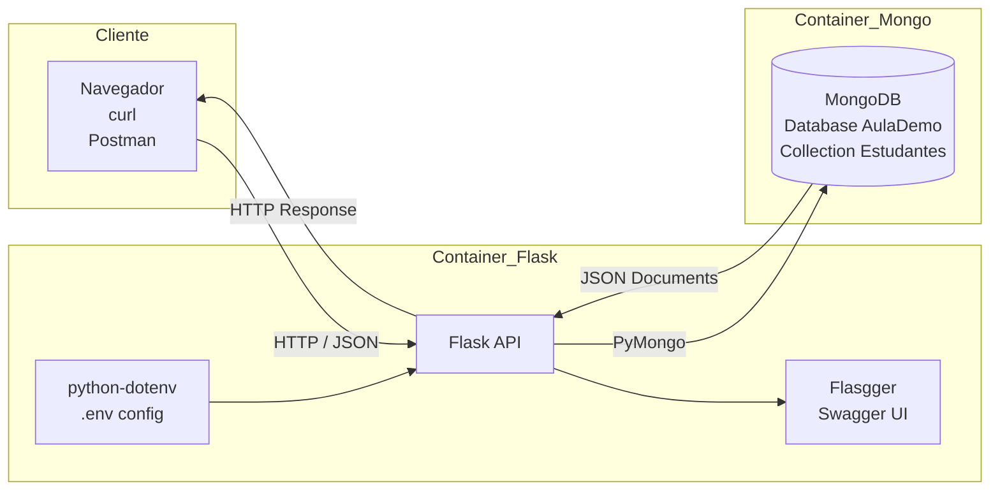

# Desenvolvendo uma API REST com Flask e Swagger

## 1. Introdução

O Flask é um microframework Python para desenvolvimento de aplicações web. Ele é bastante leve e extensível, sendo adequado tanto para iniciantes quanto para desenvolvedores experientes.

Ao contrário de frameworks mais complexos, como o Django, que já trazem diversos componentes integrados (ORM, autenticação, administração, templates, entre outros), o Flask segue uma abordagem minimalista: ele fornece apenas o núcleo necessário para construir aplicações web e permite que o desenvolvedor escolha as bibliotecas adicionais conforme a necessidade. Ambos são ferramentas profissionais. A diferença está no estilo de desenvolvimento. Neste laboratório utilizaremos Flask para construir uma API REST simples, integrada ao banco de dados MongoDB, um banco NoSQL orientado a documentos.

Em cenários onde precisamos construir APIs simples, leves e altamente integráveis,
o Flask costuma ser uma escolha muito adequada.

Flask é considerado um microframework porque fornece apenas os componentes
essenciais para construir aplicações web. Em vez de impor uma estrutura completa,
ele permite que o desenvolvedor escolha bibliotecas adicionais conforme a necessidade.

Isso torna o Flask particularmente adequado para a construção de **APIs leves**,
nas quais queremos apenas manipular requisições HTTP, processar dados e retornar
respostas JSON.

## 2. Por que usar Flask para desenvolver APIs

Flask é amplamente utilizado para construir APIs porque possui algumas características importantes:

- Estrutura simples e fácil de compreender
- Baixa complexidade inicial
- Excelente integração com bibliotecas Python
- Controle total da arquitetura da aplicação

APIs modernas frequentemente utilizam bancos **NoSQL**, como o MongoDB.
Nesse tipo de banco os dados são armazenados em documentos semelhantes a JSON.

Como APIs Flask normalmente recebem e retornam JSON, a integração com MongoDB
torna-se bastante natural.

```bash
Cliente → JSON → Flask → MongoDB
```

### Documentação automática da API com Flasgger

Uma das situações recorrentes ao trabalhar com APIs é manter a documentação atualizada. Para resolver esse problema utilizaremos o Flasgger, uma biblioteca que integra o Flask ao padrão Swagger / OpenAPI, amplamente utilizada em APIs profissionais. Isso permite gerar automaticamente uma interface interativa de documentação. Nessa interface é possível:

- visualizar todos os endpoints
- enviar requisições HTTP
- testar a API diretamente no navegador

Após executar a aplicação, a documentação estará disponível em:
`http://localhost:5000/apidocs`

Nessa interface é possível:

- visualizar todos os endpoints
- enviar requisições HTTP
- testar a API diretamente no navegador
- entender o formato esperado dos dados

### Estrutura básica do projeto

```bash
flask/
 ├── app.py
 ├── requirements.txt
 ├── Dockerfile
 ├── docker-compose.yml
 └── .env
```

### Executando o ambiente

Build da aplicação:

```shell
docker-compose build
```

Subir os containers:

```shell
docker-compose up -d
```

Verificar logs:

```shell
docker-compose logs
```

### Testando a API

Abra no navegador `http://localhost:5000`

Resposta esperada:

```json
{
 "status": "API MongoDB local online"
}
```

### Inserindo dados

Endpoint `POST /estudantes`. Exemplo de JSON:

```json
{
 "nome": "Ana",
 "idade": 21,
 "curso": "Engenharia"
}
```

Também é possível testar a API via linha de comando utilizando `curl`:

```bash
curl -X POST http://localhost:5000/estudantes \
-H "Content-Type: application/json" \
-d '{"nome":"Ana","idade":21,"curso":"Engenharia"}'
```

## 3. Implementando filtros na API

Inicialmente o endpoint `GET /estudantes` retorna todos os estudantes cadastrados.
No entanto, APIs REST modernas costumam permitir filtros através de query parameters.
Por exemplo: `/estudantes?curso=Engenharia` ou `/estudantes?idade=21`. Esses parâmetros permitem que o cliente da API solicite apenas os dados necessários. Dessa forma, podemos atualizar o nosso endpoint para suportar filtros dinâmicos. Exemplo de implementação:

```python
@app.route("/estudantes", methods=["GET"])
def listar_estudantes():

    idade = request.args.get("idade")
    curso = request.args.get("curso")

    filtro = {}

    if idade:
        filtro["idade"] = int(idade)

    if curso:
        filtro["curso"] = curso

    docs = []

    for doc in colecao.find(filtro):
        doc["_id"] = str(doc["_id"])
        docs.append(doc)

    return jsonify(docs)
```

Esses parâmetros são chamados **query parameters** e aparecem após o caractere `?`
na URL. Eles permitem que clientes da API especifiquem filtros sem alterar o
endpoint principal. Com esta implementação, agora podemos consultar por curso ou idade: `/estudantes?curso=Engenharia` ou `/estudantes?idade=21`.

## 4. Implementação de filtros com operadores

Além dos filtros simples, também podemos usar operadores de comparação do MongoDB, incrementando a API em funcionalidade (ex: `$gt`, `$lt`, `$gte` e `$lte`):

```python
@app.route("/estudantes", methods=["GET"])
def listar_estudantes():

    idade = request.args.get("idade")
    idade_gt = request.args.get("idade_gt")
    idade_gte = request.args.get("idade_gte")
    idade_lt = request.args.get("idade_lt")
    idade_lte = request.args.get("idade_lte")

    curso = request.args.get("curso")

    filtro = {}

    if idade:
        filtro["idade"] = int(idade)

    if idade_gt:
        filtro["idade"] = {"$gt": int(idade_gt)}

    if idade_gte:
        filtro["idade"] = {"$gte": int(idade_gte)}

    if idade_lt:
        filtro["idade"] = {"$lt": int(idade_lt)}

    if idade_lte:
        filtro["idade"] = {"$lte": int(idade_lte)}

    if curso:
        filtro["curso"] = curso

    docs = []

    for doc in colecao.find(filtro):
        doc["_id"] = str(doc["_id"])
        docs.append(doc)

    return jsonify(docs)
```

### Exemplos de consultas

- Todos os estudantes: `/estudantes`
- Filtrar por curso: `/estudantes?curso=Engenharia`
- Idade maior que 21: `/estudantes?idade_gt=21`
- Idade menor ou igual a 25: `/estudantes?idade_lte=25`
- Filtro combinado: `/estudantes?curso=Engenharia&idade_gt=20`

## 5. Aumentando a segurança: utilizando arquivos .env para credenciais

Evite colocar credenciais diretamente no código. Para isso, use um arquivo `.env` e adicione suporte utilizando a biblioteca

```bash
MONGO_USER=root
MONGO_PASSWORD=mongo
MONGO_HOST=mongo_service
MONGO_PORT=27017
MONGO_DB=AulaDemo
```

### Atualizando o código

No início do `app.py`, acrescente:

```python
from dotenv import load_dotenv
load_dotenv()
```

Depois carregue as variáveis:

```python
MONGO_USER = os.getenv("MONGO_USER")
MONGO_PASSWORD = os.getenv("MONGO_PASSWORD")
MONGO_HOST = os.getenv("MONGO_HOST")
MONGO_PORT = os.getenv("MONGO_PORT")
MONGO_DB = os.getenv("MONGO_DB")

MONGO_URI = f"mongodb://{MONGO_USER}:{MONGO_PASSWORD}@{MONGO_HOST}:{MONGO_PORT}"
```

E, por fim:

```python
client = MongoClient(MONGO_URI)
db = client[MONGO_DB]
```

Lembre-se de adicionar o `.env` ao `.gitignore`:

```shell
.env
```

Isso evita que credenciais sejam enviadas para o repositório, ficando restritas ao servidor, uma boa prática em pipelines CI/CD. Dessa forma, temos o seguinte diagrama para representar a solução de API que implementamos: 




