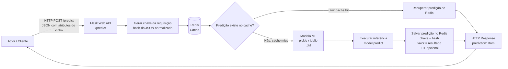

## Visão Geral de MLOps: como colocar seu modelo de Machine Learning em produção? 

## 1. Introdução

O Machine Learning (ML) está cada vez mais presente em aplicações modernas, viabilizando personalização, automação de decisões e previsões em tempo real em áreas como e-commerce, saúde e redes sociais. Neste laboratório, você criará uma API simples para servir um modelo de ML, explorando roteamento, conteúdo estático/dinâmico e uso do depurador. Trabalharemos com quatro camadas de um sistema de ML em produção:

- Serving: API Flask para expor o modelo via HTTP
- Performance: Redis para evitar recomputação de predições
- Persistência: MongoDB para armazenar dados e inferências
- MLOps: monitoramento, detecção de drift e reavaliação contínua do modelo

Cada componente resolve um problema específico dentro da arquitetura.

## 2. Fundamentos de MLOps


Em muitos cenários, construir um modelo de Machine Learning (ML) é apenas o começo. Com o tempo, esses modelos podem se degradar à medida que os dados utilizados para treinamento se tornam obsoletos ou mudam significativamente. Manter o modelo operacional e preciso em produção torna-se um grande desafio.

MLOps (Machine Learning Operations) é uma prática que une o desenvolvimento de modelos de ML com operações de TI (DevOps), garantindo que esses modelos sejam implantados, monitorados, mantidos e escaláveis em ambientes de produção. Seu principal objetivo é garantir que os modelos de ML sejam continuamente integrados, implantados e monitorados com eficiência e confiabilidade. 

Para isso, o MLOps abrange todo o ciclo de vida do modelo, desde o treinamento inicial até a implantação e manutenção. Isso inclui práticas como automação e versionamento, que garantem que novos modelos sejam atualizados e testados sem interrupções, evitando falhas e inconsistências. Um aspecto fundamental do MLOps é a Integração Contínua e Implantação Contínua (CI/CD), que permite que novos modelos sejam rapidamente integrados ao ambiente de produção por meio de pipelines automatizados.

O monitoramento contínuo é outra prática essencial do MLOps. Ele inclui o registro de todas as previsões feitas pela API, juntamente com os dados de entrada e o armazenamento dos resultados reais. Com esses dados, é possível comparar as previsões com os resultados reais e calcular métricas de desempenho, avaliando se o modelo está se degradando ao longo do tempo.

Um conceito importante relacionado ao monitoramento é o drift, que ocorre quando os padrões dos dados de entrada ou a relação entre as variáveis e o alvo mudam. O drift de dados reflete mudanças nos padrões dos dados, enquanto o drift de conceito afeta diretamente a capacidade do modelo de realizar previsões corretas. Monitorar a distribuição das variáveis de entrada e o desempenho do modelo ao longo do tempo permite detectar esses problemas.

Finalmente, um pipeline de avaliação contínua é recomendável para garantir que o modelo permaneça confiável. Esse pipeline deve registrar automaticamente as previsões do modelo, armazenar os resultados reais, calcular métricas periodicamente e gerar alertas caso o desempenho caia abaixo de um limite aceitável. Dessa forma, o modelo mantém sua precisão e utilidade em um ambiente de produção.

Nesta etapa, os conceitos de MLOps serão apresentados de forma introdutória, sendo aprofundados conforme a evolução da arquitetura.


## 3. Exportação do Modelo Treinado

Uma etapa crucial na implementação de um modelo de ML em produção é a exportação do modelo treinado para um formato que possa ser facilmente carregado e utilizado por aplicações. Geralmente optamos pelo uso do formato `pickle` para realizar essa tarefa. O formato `pickle` oferece uma maneira padrão para serializar objetos em Python. Isso significa que ele pode transformar qualquer objeto Python, incluindo modelos complexos de Machine Learning, em uma sequência de bytes que pode ser salva em um arquivo.

### Por Que Usar o Formato Pickle?

O principal benefício de utilizar o formato `pickle` para exportar modelos de Machine Learning é a sua eficiência e simplicidade em armazenar e recuperar os modelos treinados. Em um cenário de produção, o tempo necessário para treinar um modelo pode ser proibitivo, especialmente com grandes volumes de dados ou algoritmos complexos que requerem alto poder computacional. Assim, treinar o modelo a cada nova requisição de previsão torna-se inviável.

Exportar o modelo treinado como um arquivo `pickle` permite que o modelo seja carregado rapidamente por nossa aplicação Flask, sem a necessidade de reprocessar os dados ou retreinar o modelo. Isso é essencial para garantir a agilidade das respostas em um ambiente de produção, onde a performance e o tempo de resposta são críticos.

### Como Exportar e Carregar um Modelo com Pickle

Exportar um modelo para um arquivo pickle é um processo simples. Primeiro, o modelo é treinado. Após o treinamento, o modelo é serializado com o módulo `pickle` e salvo em um arquivo `.pkl`. O código a seguir exemplifica este processo:

```python
import pickle
from sklearn.ensemble import RandomForestClassifier

# Treinando o modelo
model = RandomForestClassifier()
model.fit(x_train, y_train)

# Salvando o modelo em um arquivo pickle
with open('model.pkl', 'wb') as file:
    pickle.dump(model, file)

```

## 4. Serviço de Inferência

O componente desenvolvido neste laboratório é conhecido como Model Serving Layer, responsável por disponibilizar o modelo treinado para consumo via API. Para utilizar o modelo em nossa aplicação Flask, simplesmente carregamos o arquivo pickle, deserializamos o objeto e utilizamos para fazer previsões:

```python
# Carregando o modelo do arquivo pickle
with open('model.pkl', 'rb') as file:
    loaded_model = pickle.load(file)

# Usando o modelo carregado para fazer previsões
prediction = loaded_model.predict(X_new)
```

### Rotas Dinâmicas

Vamos permitir que os usuários interajam com o aplicativo por meio de rotas dinâmicas. Podemos submeter via método `HTTP POST` um `.json` com as variáveis preditoras e o aplicativo retornará a previsão da variável alvo. Abaixo, exemplo de um vinho de qualidade "ruim": 

```shell
 curl -X POST   -H "Content-Type: application/json"   -d '{
        "fixed acidity": 7.0,
        "volatile acidity": 0.27,
        "citric acid": 0.36,
        "residual sugar": 20.7,
        "chlorides": 0.045,
        "free sulfur dioxide": 45.0,
        "total sulfur dioxide": 170.0,
        "density": 1.0010,
        "pH": 3.00,
        "sulphates": 0.45,
        "alcohol": 8.8,
        "color": 1
      }'   http://localhost:5000/predict
```

- Abaixo, exemplo de código para um vinho de qualidade "boa": 

```shell
 curl -X POST   -H "Content-Type: application/json"   -d '{
        "fixed acidity":7.7,
        "volatile acidity":0.44,
        "citric acid":0.24,
        "residual sugar":11.2,
        "chlorides":0.031,
        "free sulfur dioxide":41.0,
        "total sulfur dioxide":167.0,
        "density":0.9948,
        "pH":3.12,
        "sulphates":0.43,
        "alcohol":11.3,
        "color":1
    }'   http://localhost:5000/predict
```
Neste laboratório, a variável alvo foi codificada da seguinte forma:

- `quality < 7` → `ruim` → classe `1`
- `quality >= 7` → `bom` → classe `0`

Essa decisão foi adotada porque o dataset é desbalanceado, com maior concentração de vinhos abaixo da nota 7.

- Você também pode utilizar um arquivo para fazer `POST` do arquivo `.json`. Seguem exemplos: 

```shell
curl -X POST -H "Content-Type: application/json" -d @bom.json http://localhost:5000/predict
```

```shell
curl -X POST -H "Content-Type: application/json" -d @ruim.json http://localhost:5000/predict
```

- Outra forma de testar a API é com o Swagger (rota `/apidocs`) uma extensão como o Postman, diretamente em seu navegador, para fazer as vezes do `curl` mas com uma interface gráfica. 

## 5. Pipeline de Inferência

Neste laboratório, o objetivo é estruturar um pipeline completo orientado a dados, no qual uma aplicação web interage com um banco NoSQL e evolui para suportar inferência de modelos de Machine Learning em produção. A arquitetura proposta combina três elementos centrais:

- API REST com Flask
- Banco NoSQL MongoDB
- Pipeline de inferência com modelo previamente treinado e persistido em formato `.pickle`

Em aplicações modernas, especialmente aquelas orientadas a eventos e APIs, é comum os dados utilizarem o formato JSON. O MongoDB armazena documentos nesse mesmo formato (BSON), eliminando a necessidade de transformação rígida típica de bancos relacionais. Isso permite maior flexibilidade para evoluir o schema, algo essencial quando passamos a incorporar features de ML e resultados de predição diretamente nos documentos. Inicialmente, a API que você construiu realiza operações básicas: 

>Cliente → Flask → MongoDB

Agora o fluxo passa a incorporar uma etapa adicional:

>Cliente → Flask → Modelo ML → MongoDB

Ou seja:

- o cliente envia dados (JSON)
- a API processa
- o modelo gera uma previsão
- o resultado é armazenado junto ao documento, transformando-o em um repositório de dados enriquecidos.

### Dataset 

Como exemplo, podemos utilizar o dataset Wine Quality Dataset: 

O carregamento inicial no MongoDB pode ser feito via:

```
wget https://raw.githubusercontent.com/klaytoncastro/idp-machinelearning/refs/heads/main/winequality/winequality-merged.csv
docker exec -it mongo_service mongoimport --db machinelearning --collection winequality --type csv --file /datasets/winequality-merged.csv --headerline --ignoreBlanks --username root --password mongo --authenticationDatabase admin
```

Após a importação, cada linha do dataset torna-se um documento JSON no MongoDB, por exemplo:

{
  "fixed acidity": 7.4,
  "volatile acidity": 0.70,
  "citric acid": 0.00,
  "alcohol": 9.4
}

### Enriquecimento do Documento com Predição

A evolução natural é incluir no documento um novo campo derivado do modelo:

{
  "fixed acidity": 7.4,
  "volatile acidity": 0.70,
  "citric acid": 0.00,
  "alcohol": 9.4,
  "prediction": "ruim"
}

Ou, para cenários mais completos:

{
  "features": { ... },
  "prediction": 0,
  "probability": 0.87,
  "timestamp": "2026-03-30T12:00:00Z"
}

Isso insere alguns conceitos fundamentais em MLOps:

- persistência de inferência
- rastreabilidade de decisões
- base para monitoramento de modelo
- Transição Conceitual: API → MLOps

Assim, a API evolui de um serviço HTTP e passa a representar um componente de um sistema maior:

- recebe dados
- serving de modelo via API
- armazena resultados
- registro de predições permite auditoria e análise posterior
- preparação para monitoramento (drift, métricas, etc.)


### Exemplo de arquitetura com cache

Em cenários reais, a mesma requisição pode ocorrer diversas vezes. Reexecutar a inferência para entradas idênticas aumenta a latência e o custo computacional. Para resolver esse problema, utilizamos Redis como camada de cache, armazenando o resultado de predições já realizadas. Ou seja, Redis não é utilizado como banco de dados principal, mas como cache de baixa latência. Já o MongoDB pode ser utilizado para persistência de longo prazo, auditoria e análise histórica das predições.



### Exemplo de implementação com Redis: 

```python
from flask import Flask, request, jsonify
from flasgger import Swagger
from joblib import load
import os
import json
import redis
import hashlib

app = Flask(__name__)

app.config['SWAGGER'] = {
    'title': 'API de Previsão com Redis',
    'version': '1.0.0',
    'description': 'API para importação e previsão de qualidade de vinhos'
}
Swagger(app)

r = redis.Redis(host='redis', port=6379, decode_responses=True)

MODEL_VERSION = "v1"
CACHE_TTL_SECONDS = 86400  # 24 horas

modelo_path = os.path.join('models', 'modelo_v1.pkl')
modelo = load(modelo_path)

campos_obrigatorios = [
    'fixed acidity', 'volatile acidity', 'citric acid', 'residual sugar',
    'chlorides', 'free sulfur dioxide', 'total sulfur dioxide',
    'density', 'pH', 'sulphates', 'alcohol', 'color'
]


def gerar_chave(dados):
    conteudo = json.dumps(
        dados,
        sort_keys=True,
        separators=(',', ':')
    )

    hash_entrada = hashlib.md5(conteudo.encode()).hexdigest()

    return f"wine:prediction:{MODEL_VERSION}:{hash_entrada}"


def executar_predicao(dados):
    valores = [dados[campo] for campo in campos_obrigatorios]
    predicao = modelo.predict([valores])[0]

    return 'ruim' if predicao == 1 else 'bom'


@app.route('/import', methods=['POST'])
def import_data():
    try:
        vinhos = request.get_json()

        if not isinstance(vinhos, list):
            return jsonify({
                "error": "Payload inválido",
                "message": "O endpoint /import espera uma lista de vinhos."
            }), 400

        total_recebidos = len(vinhos)
        total_processados = 0
        total_cache_existente = 0

        for vinho in vinhos:
            chave = gerar_chave(vinho)

            cache = r.get(chave)

            if cache is not None:
                total_cache_existente += 1
                continue

            resultado = executar_predicao(vinho)

            resposta_cache = {
                "prediction": resultado,
                "model_version": MODEL_VERSION
            }

            r.setex(
                chave,
                CACHE_TTL_SECONDS,
                json.dumps(resposta_cache)
            )

            total_processados += 1

        return jsonify({
            "msg": "Importação concluída",
            "total_received": total_recebidos,
            "total_processed": total_processados,
            "total_already_cached": total_cache_existente,
            "model_version": MODEL_VERSION,
            "cache_ttl_seconds": CACHE_TTL_SECONDS
        }), 200

    except KeyError as e:
        return jsonify({
            "error": "Campo obrigatório ausente",
            "missing_field": str(e)
        }), 400

    except Exception as e:
        return jsonify({
            "error": "Erro interno no servidor",
            "detail": str(e)
        }), 500


@app.route('/predict', methods=['POST'])
def predict():
    try:
        data = request.get_json()
        chave = gerar_chave(data)

        cache = r.get(chave)

        if cache is not None:
            resposta = json.loads(cache)
            resposta["source"] = "cache"
            return jsonify(resposta), 200

        resultado = executar_predicao(data)

        resposta = {
            "prediction": resultado,
            "source": "model",
            "model_version": MODEL_VERSION
        }

        resposta_cache = {
            "prediction": resultado,
            "model_version": MODEL_VERSION
        }

        r.setex(
            chave,
            CACHE_TTL_SECONDS,
            json.dumps(resposta_cache)
        )

        return jsonify(resposta), 200

    except KeyError as e:
        return jsonify({
            "error": "Campo obrigatório ausente",
            "missing_field": str(e)
        }), 400

    except Exception as e:
        return jsonify({
            "error": "Erro interno no servidor",
            "detail": str(e)
        }), 500


if __name__ == "__main__":
    app.run(host="0.0.0.0", port=5000, debug=True)
```

### Importação de Amostras

```shell
# Carregamento de 03 amostras
curl -X POST "http://localhost:5000/import" \
  -H "Content-Type: application/json" \
  -d '[
    {
      "fixed acidity": 7,
      "volatile acidity": 0.27,
      "citric acid": 0.36,
      "residual sugar": 20.7,
      "chlorides": 0.045,
      "free sulfur dioxide": 45,
      "total sulfur dioxide": 170,
      "density": 1.001,
      "pH": 3,
      "sulphates": 0.45,
      "alcohol": 8.8,
      "color": 0
    },
    {
      "fixed acidity": 6.3,
      "volatile acidity": 0.3,
      "citric acid": 0.34,
      "residual sugar": 1.6,
      "chlorides": 0.049,
      "free sulfur dioxide": 14,
      "total sulfur dioxide": 132,
      "density": 0.994,
      "pH": 3.3,
      "sulphates": 0.49,
      "alcohol": 9.5,
      "color": 0
    },
    {
      "fixed acidity": 8.1,
      "volatile acidity": 0.28,
      "citric acid": 0.4,
      "residual sugar": 6.9,
      "chlorides": 0.05,
      "free sulfur dioxide": 30,
      "total sulfur dioxide": 97,
      "density": 0.9951,
      "pH": 3.26,
      "sulphates": 0.44,
      "alcohol": 10.1,
      "color": 0
    }
  ]'
```

### Comando para o teste:

```bash
curl -X POST "http://localhost:5000/predict" \
  -H "Content-Type: application/json" \
  -d '{
    "fixed acidity": 7,
    "volatile acidity": 0.27,
    "citric acid": 0.36,
    "residual sugar": 20.7,
    "chlorides": 0.045,
    "free sulfur dioxide": 45,
    "total sulfur dioxide": 170,
    "density": 1.001,
    "pH": 3,
    "sulphates": 0.45,
    "alcohol": 8.8,
    "color": 0
  }'
```

>Em uma arquitetura completa, Redis atua como cache de baixa latência, enquanto MongoDB pode armazenar o histórico das requisições, predições, versões do modelo e resultados reais para auditoria e monitoramento.

## Tarefa: Coloque outro modelo de ML em Produção

### Objetivo

Nesta atividade, você vai selecionar um problema de classificação ou regressão, treinar um modelo de ML e implementá-lo em produção utilizando Flask como servidor web. O modelo será exportado utilizando a biblioteca `joblib` e o formato `pickle`, permitindo que a API Flask o utilize para fazer previsões a partir de dados recebidos em formato JSON.

### Instruções

Escolha um problema de classificação ou regressão de sua preferência. Por exemplo, você pode optar por utilizar alguns dos datasets que já trabalhamos, como o Air Quality para prever a qualidade do ar, California Housing, para prever o preço de casas, que são tarefas de regressão, ou Bank Marketing para prever se um cliente irá adquirir ou não um produto (classificação) ou, ainda, o pacote `sklearn.datasets`, que disponibiliza alguns conjuntos de dados como o Iris para prever o tipo de uma flor, e outros mais.

### Treinamento do modelo

Utilize o conjunto de dados escolhido para desenvolver e treinar um modelo de ML, optando por um algoritmo como RandomForest, Decision Tree, Linear Regression, ExtraTrees, LightGBM, XGBoost, etc. Após o treinamento, exporte o modelo para um arquivo `.pkl` e adapte a aplicação Flask que apresentamos acima para corresponder à sua escolha.
